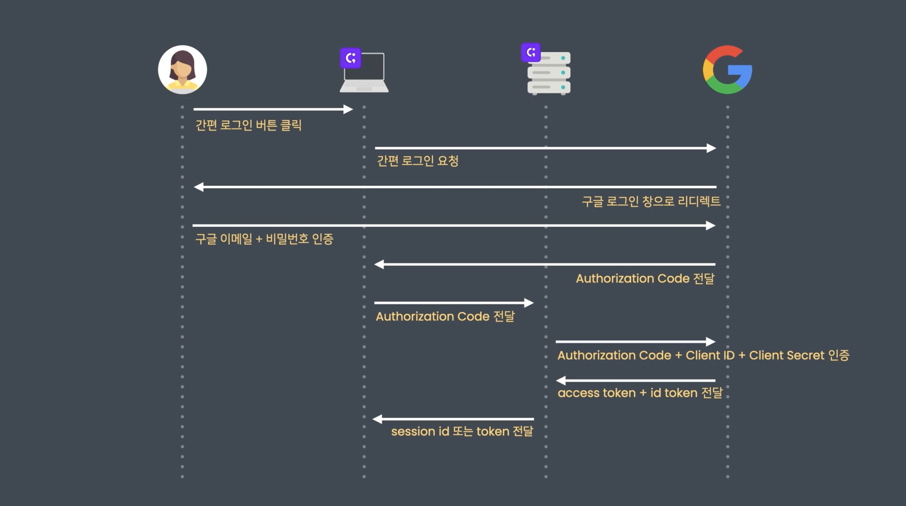

## 세션 기반 인증과 토큰 기반 인증을 비교해서 설명해 주세요.

두 가지 인증 방법은 인증서에 따라 나뉩니다.

먼저 세션 기반 인증은 인증서가 세션 아이디인 경우입니다.
서버에 첫 번째 리퀘스트를 보내면 서버는 이 방문에 대한 데이터를 저장합니다.
이후 응답할 때 Set-Cookie 헤더에 해당 방문에 대한 아이디를 추가하여 클라이언트에 전달합니다.

응답을 받은 브라우저는 Set-Cookie 헤더에 의해 자동으로 아이디를 쿠키를 통해 저장하고,
매번 리퀘스트를 보낼 때마다 세션 아이디가 포함되어 전달됩니다.
이를 통해 서버는 리퀘스트를 보낸 유저를 특정지을 수 있습니다.

토큰 기반 인증은 인증서가 토큰인 경우입니다.
클라이언트에서 올바른 로그인 리퀘스트를 보냈을 때 서버는 토큰을 발행합니다.
이때 서버만 알고 있는 비밀키를 사용해서 암호화합니다.
이후 클라이언트에서 리퀘스트를 보낼 때 Authorization 헤더에 Bearer 키워드와 함께 토큰을 포함해 전송합니다.
그리고 서버는 비밀키를 사용해 토큰을 다시 해석하고 유저를 특정지을 수 있습니다.

## Authorization Code를 활용하는 구글 소셜 로그인을 실행하기 까지 유저, 프론트엔드, 백엔드, OpenID Connect 프로바이더 사이에 어떤 과정을 거치는지 설명해 주세요.

1. `유저` 서비스 접근 및 간편 로그인 버튼 클릭
2. `프론트엔드` 간편 로그인 요청
3. `OpenID Connect 프로바이더` 로그인 페이지 제공, 간편 로그인 이메일/PW 요청
4. `유저` 간편 로그인 이메일/PW 입력하여 본인 인증
5. `OpenID Connect 프로바이더` 프론트엔드에 Authorization Code 발급
6. `프론트엔드` 백엔드에 Authorization Code 전달
7. `백엔드` Authorization Code + Client ID + Client Secret 인증
8. `OpenID Connect 프로바이더` 백엔드에 Access Token + ID Token 발급
9. `백엔드` 프론트엔드로 Session ID 또는 Token 전달
